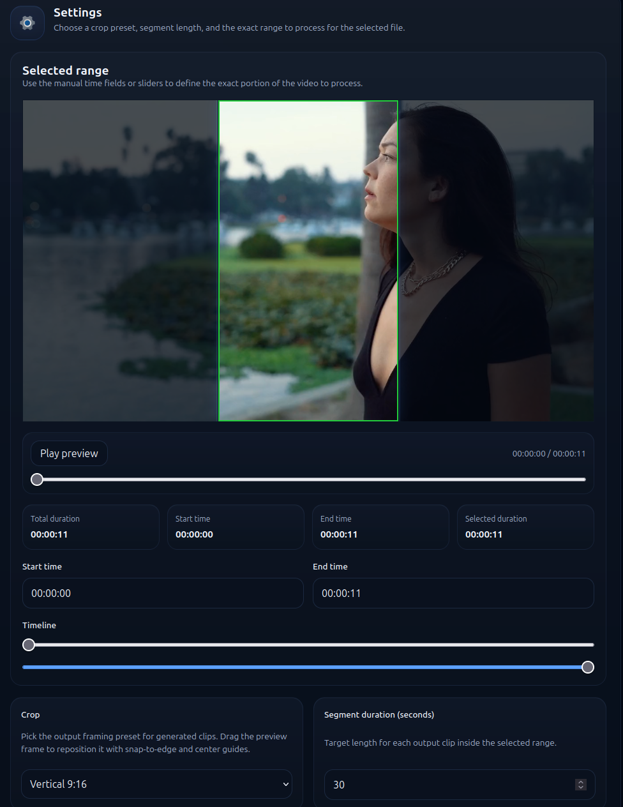

# Video Auto Cutter

Local web app for cutting videos: choose an exact range, split it into clips of a fixed length, and optionally apply a crop preset.



## What It Does

- Trim only the part of the video you need
- Split the selected range into fixed-length clips
- Apply crop presets and move the crop area in the preview
- Process multiple files in a queue
- Show progress directly in the browser

## Requirements

- Python 3.11 or newer
- Node.js 20 or newer
- npm
- FFmpeg available from the terminal

## Quick Check Before You Start

If the commands below print version numbers, the required tools are already installed.

### Windows

Open PowerShell and run:

```powershell
py --version
node --version
npm --version
ffmpeg -version
```

### macOS / Linux

Open a terminal and run:

```bash
python3 --version
node --version
npm --version
ffmpeg -version
```

If any command is not found, install that tool first and then reopen the terminal.

## Easiest Way to Run on Windows

1. Download the project as a ZIP file or clone the repository.
2. Extract it and open the project folder.
3. Open PowerShell in that folder.
4. Run these commands one by one:

```powershell
py -m venv .venv
.venv\Scripts\pip install -r requirements.txt
cd ui
npm install
cd ..
.venv\Scripts\python scripts\run_local.py
```

5. Open `http://localhost:5173` in your browser.
6. Keep the PowerShell window open while the app is running.
7. To stop the app, go back to PowerShell and press `Ctrl+C`.

Notes:

- `npm install` may take a few minutes the first time.
- Finished clips will appear in the `outputs` folder in the project root.
- `http://localhost:8000` is used by the backend. Most users only need `http://localhost:5173`.

## Easiest Way to Run on macOS / Linux

1. Download the project as a ZIP file or clone the repository.
2. Open a terminal in the project folder.
3. Run these commands one by one:

```bash
python3 -m venv .venv
.venv/bin/pip install -r requirements.txt
cd ui
npm install
cd ..
.venv/bin/python scripts/run_local.py
```

4. Open `http://localhost:5173` in your browser.
5. To stop the app, press `Ctrl+C` in the terminal.

## If the One-Command Start Does Not Work

Sometimes it is easier to start the backend and frontend separately in two terminal windows.

### Windows

Window 1:

```powershell
.venv\Scripts\python -m uvicorn api.main:app --reload
```

Window 2:

```powershell
cd ui
npm run dev
```

### macOS / Linux

Window 1:

```bash
.venv/bin/python -m uvicorn api.main:app --reload
```

Window 2:

```bash
cd ui
npm run dev
```

Then open `http://localhost:5173`.

## Common Problems

### `ffmpeg` is not found

FFmpeg is not installed or is not available in `PATH`. Install it and reopen the terminal.

### `py` is not found on Windows

Try using `python` instead of `py`. If that does not help, reinstall Python and enable the option to add it to `PATH`.

### `node` or `npm` are not found

Install Node.js and then reopen the terminal.

### `http://localhost:5173` does not open

Most likely one of the commands failed. Check the terminal output for the error message. Another common reason is that port `5173` or `8000` is already being used by another program.

## Ready-Made Windows Build

A ready-made Windows installer is not published yet. For now, the app runs from source using the steps above.

Technical steps for building a Windows installer are available in `windows-installer-steps.txt`.
